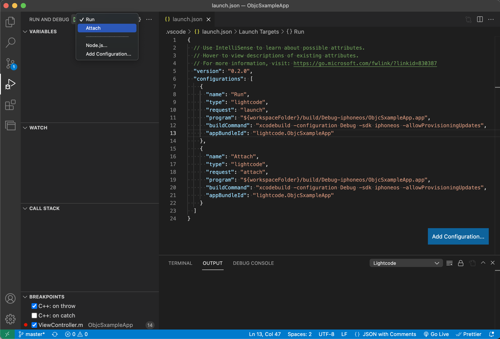
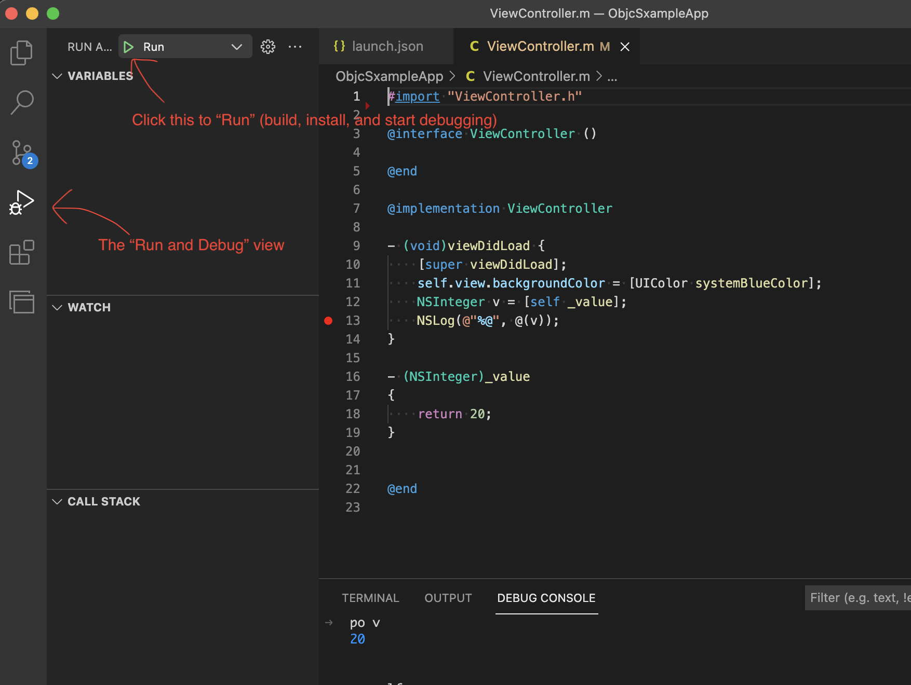

# Overview

Lightcode is a VSCode extension to debug iOS apps on iPhone - a lightweight alternative to Xcode.

## Features
**Two common modes**:
- **Run**: build the app, install to iPhone, launch the app to start debugging.
- **Attach**: with the app already installed, launch the app to start debugging right away.



**Debug features**:
- Breakpoints, callstacks, inspect local variables.
- Use `po` to check variables.


# Setup
## Quickstart
Sample iOS app to try it out: [ObjcSampleApp](https://github.com/khitcher/lightcode-doc/tree/master/ObjcSxampleApp)
* Create [launch configurations](https://code.visualstudio.com/docs/editor/debugging#_launch-configurations) in your project folder. This is just a `./vscode/launch.json` in the project's root folder.
* Replace the content of `launch.json` as below, make sure to update `<Your app's name>` and `<Your app bundle ID>`:
```
{
  "version": "0.2.0",
  "configurations": [
    {
      "name": "Run",
      "type": "lightcode",
      "request": "launch",
      "program": "${workspaceFolder}/build/Debug-iphoneos/<Your app's name>.app",
      "buildCommand": "xcodebuild -configuration Debug -sdk iphoneos -allowProvisioningUpdates",
      "appBundleId": "<Your app bundle ID>"
    },
    {
      "name": "Attach",
      "type": "lightcode",
      "request": "attach",
      "program": "${workspaceFolder}/build/Debug-iphoneos/<Your app's name>.app",
      "buildCommand": "xcodebuild -configuration Debug -sdk iphoneos -allowProvisioningUpdates",
      "appBundleId": "<Your app bundle ID>"
    }
  ]
}
```
* Open the project folder with VSCode; in the "Run and Debug" view, click the Run button.


## `launch.json` details

To use this extension, you just need to properly write the `configurations` array in `launch.json`. VSCode automatically creates a button for each item in the `configurations` array. For example, when an item has `"name": "Run"`, a `Run` button will show up in VSCode.

The `Run` and `Attach` configurations share the same 6 fields. Here is the definition of each field:
- `name`: just a name of the configuration. It will show up as button in VSCode "Run and Debug" view.
- `type`: set it as `lightcode`. This is to let VSCode know that you want to use this extension to debug the iOS project.
- `request`: 2 allowed values - `launch` to build, install, and launch the app; `attach` to launch the app directly, skipping build and install.
- `program`: the location of the build output (the `YourAppName.app` file).
  - When using Xcode's default build system, this is usually `"${workspaceFolder}/build/Debug-iphoneos/<Your app's name>.app"`. `${workspaceFolder}` is a VSCode convenient variable to represent ("the folder where VSCode was opened")
  - When using [BUCK](buck.build), this is usually `"${workspaceFolder}/buck-out/...`
- `buildCommand`: the command to build your iOS app.
  - When using Xcode's default build system, this is usually `xcodebuild -configuration Debug -sdk iphoneos -allowProvisioningUpdates`
  - When using [BUCK](buck.build), this is usually `buck build folder:target`
- `appBundleId`: the `Bundle Identier` of the iOS project, which can be found in Xcode.

# Feedback
Feedback on how to improve the extension is very welcome!
* [Github issues](https://github.com/khitcher/lightcode-doc/issues)
* Email me: kennyhitcher at gmail dot com

# Acknowledgement
- The LLDB part of the extension is a fork from [CodeLLDB](https://marketplace.visualstudio.com/items?itemName=vadimcn.vscode-lldb)
- The iOS part of the extension is a fork from [iOS debug](https://marketplace.visualstudio.com/items?itemName=nisargjhaveri.ios-debug)
